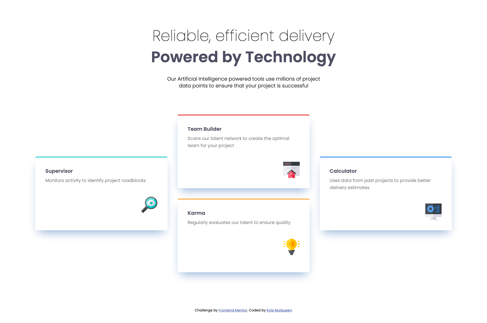
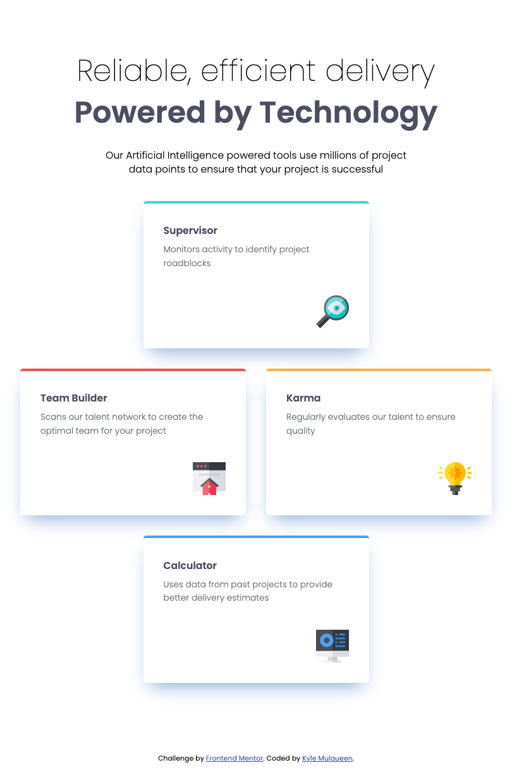
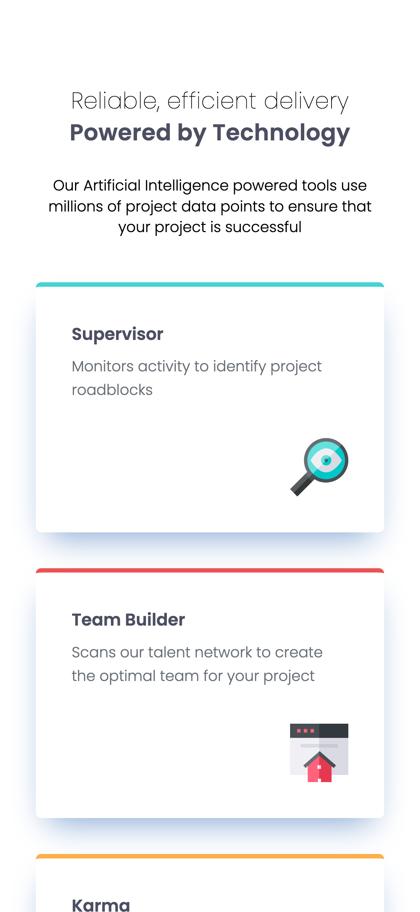

# Frontend Mentor - Four card feature section solution

This is a solution to the [Four card feature section challenge on Frontend Mentor](https://www.frontendmentor.io/challenges/four-card-feature-section-weK1eFYK). Frontend Mentor challenges help you improve your coding skills by building realistic projects.

## Table of contents

- [Frontend Mentor - Four card feature section solution](#frontend-mentor---four-card-feature-section-solution)
  - [Table of contents](#table-of-contents)
  - [Overview](#overview)
    - [The challenge](#the-challenge)
    - [Screenshot](#screenshot)
    - [Links](#links)
  - [My process](#my-process)
    - [Built with](#built-with)
    - [What I learned](#what-i-learned)
    - [Continued development](#continued-development)
  - [Useful resources](#useful-resources)
  - [Author](#author)

## Overview

### The challenge

Users should be able to:

- View the optimal layout for the site depending on their device's screen size

### Screenshot


**Desktop solution**


**Tablet solution**


**Mobile solution (screenshot clipped at end)**

### Links

- Solution URL: [Add solution URL here](https://your-solution-url.com)
- Live Site URL: [Add live site URL here](https://your-live-site-url.com)

## My process

### Built with

- Semantic HTML5 markup
- CSS custom properties
- Flexbox
- CSS Grid
- Mobile-first workflow

### What I learned

During this Frontend Mentor challenge, I learned several important concepts about modern CSS layouts and responsive design:

1. **Grid Area Positioning for Creative Layouts**: I implemented a fully responsive card layout that transforms from a simple stacked mobile view to a complex diamond-shaped arrangement on desktop. The most challenging aspect was positioning the cards in a visually balanced pattern using grid-area:

   ```css
   /* Desktop layout */
   @media (min-width: 1100px) {
     .cards-container {
       grid-template-rows: repeat(4, 6.33rem);
       grid-template-columns: repeat(3, 1fr);
     }
     .card--supervisor {
       grid-area: 2/1/4/2;
     }
     .card--team-builder {
       grid-area: 1/2/3/3;
     }
     .card--calculator {
       grid-area: 2/3/4/4;
     }
     .card--karma {
       grid-area: 3/2/5/3;
     }
   }
   ```

   I initially wondered if decimal values like `grid-area: 1/1.5/2/2.5` were possible for even more precise positioning, but learned that CSS Grid only supports integer-based line numbers.

2. **Semantic HTML Structure**: I implemented a clean, semantic HTML structure using appropriate tags like `<article>` for each card and proper heading hierarchy. This improves accessibility and SEO while providing clear hooks for styling:

   ```html
   <article class="card card--supervisor">
     <h1 class="card__title text-preset-3">Supervisor</h1>
     <p class="card__description text-preset-5">
       Monitors activity to identify project roadblocks
     </p>
     
   </article>
   ```

3. **CSS Custom Properties for Design Systems**: I created a comprehensive design token system using CSS variables for colors, typography, spacing, and more. This approach ensures consistency throughout the design and makes theme changes simple:

   ```css
   :root {
     --color-red: hsl(0, 78%, 62%);
     --color-cyan: hsl(180, 62%, 55%);
     --font-size-sm: clamp(0.9375rem, calc(0.91rem + 0.14vw), 1rem);
     --spacing-400: 2rem;
     /* Other variables... */
   }
   ```

4. **Fluid Typography with `clamp()`**: Instead of fixed font sizes that change abruptly at breakpoints, I implemented truly responsive typography using the `clamp()` function, creating a seamless reading experience across device sizes:

   ```css
   --font-size-lg: clamp(
     2.25rem,
     calc(1.8rem + 2.25vw),
     3rem
   ); /* 36px to 48px */
   ```

5. **Text Preset System**: I created reusable text preset classes that combine font-size, weight, line-height, and other typographic properties, making it easy to maintain consistent typography throughout the site:

   ```css
   .text-preset-3 {
     font-size: var(--font-size-sm);
     font-weight: var(--font-weight-bold);
     line-height: var(--line-height-sm);
     color: var(--color-grey-dark);
   }
   ```

6. **Hybrid Layout Techniques**: I learned how to effectively combine CSS Grid for overall page layout with Flexbox for component-level styling, leveraging the strengths of each:

   ```css
   .cards-container {
     display: grid;
     gap: var(--spacing-400);
   }

   .card {
     display: flex;
     flex-direction: column;
   }
   ```

### Continued development

In future projects, I want to focus on:

1. **Grid Template Areas**: While I used grid-area with numeric positioning in this project, I'd like to explore named grid areas for more readable and maintainable layouts, especially for complex designs.

2. **Advanced Grid Techniques**: I'm interested in exploring techniques to achieve visual effects like "half-column" positioning using either more granular grids or strategic placement with `fr` units.

3. **Animation and Transitions**: Adding subtle animations between grid states as the viewport changes size would enhance the user experience. I'd like to explore CSS transitions for smooth layout transformations.

4. **Accessibility Enhancements**: While I used semantic HTML, I want to further improve accessibility by implementing proper ARIA attributes and ensuring perfect keyboard navigation, especially for complex grid layouts.

5. **Performance Optimization**: I want to explore techniques for optimizing CSS Grid layouts for performance, particularly when using complex transformations across breakpoints.

## Useful resources

- [Josh Comeau's CSS Grid Tutorial](https://www.joshwcomeau.com/css/interactive-guide-to-grid/) - This helped me understand the intricacies of CSS Grid.

- [Fluid Type Scale Calculator](https://www.fluid-type-scale.com/) - This tool was invaluable for generating my fluid typography with clamp() functions.

- [CSS Tricks: A Complete Guide to Grid](https://css-tricks.com/snippets/css/complete-guide-grid/) - This comprehensive guide helped me understand grid positioning and develop creative layouts.

- [Kevin Powell's YouTube Channel](https://www.youtube.com/kevinpowell) - His tutorials on modern CSS techniques, particularly on combining Grid and Flexbox, were extremely helpful.

## Author

- Website - [Kyle Mulqueen](https://kmulqueen.github.io/portfolio-2025/)
- Frontend Mentor - [@kmulqueen](https://www.frontendmentor.io/profile/kmulqueen)
